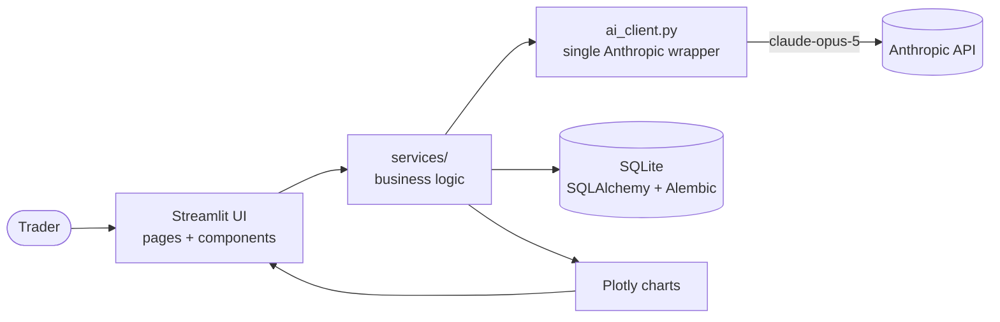

<!-- Badges (HTML img so they are not markdown screenshot links) -->
<p>
  
  
  
  
  
</p>

# TradeLens AI

**A post-trade reflection journal and analytics dashboard for SMC/ICT day traders — it reviews every chart, grades your process against your own rules, and learns your corrections.** Not a signal app, not a bot, not financial advice.

**Live demo:** [https://tradelenai.streamlit.app/](https://tradelenai.streamlit.app/) · runs in `DEMO_MODE` (cached AI, zero API spend).

<!-- screenshot: dashboard — full home dashboard with KPI glass cards, equity curve, and Trade of the Week. Replace after Streamlit Cloud deploy. -->

---

## What makes TradeLens different

Most journals store outcomes. TradeLens models the *process* behind them, with structure a generic journal can't express:

- **SMC/ICT-native schema** — first-class fields for HTF bias, killzones, liquidity sweeps, FVGs, order blocks, BOS/CHoCH, confirmation model, and entry type. Not free-text notes — queryable columns that power analytics.
- **Strategy-aware grading** — trades are graded A–F on *process*, scored against the rules in *your* Strategy Profile, not a generic checklist.
- **Correction memory** — every time you edit an AI label, the change is stored and injected as few-shot context into future calls, so the model stops repeating mistakes you've already corrected.
- **Weekly AI review** — a structured 5-section retrospective over the last 7 days, with the model's reasoning surfaced in a "How the AI reasoned" expander.
- **AI Partner Mode** — a multi-turn chat that reviews completed trades in precise SMC/ICT language, hard-scoped against signals or predictions.
- **Edge-leak & consistency analytics** — quantifies what rule-breaks cost you and scores process consistency 0–100.

---

## Architecture



Pages only render and call services; **all** business logic lives in `services/`, and **all** AI calls route through one audited `ai_client.py` (no page ever calls the API directly). Database access is SQLAlchemy 2.x over SQLite (Postgres-ready), with every schema change shipped as a reversible Alembic migration.

---

## Features

| Feature | What it does | Screenshot |
|---|---|---|
| New Trade | Log a trade with full SMC/ICT fields; killzone auto-fills from entry time | <!-- screenshot: new-trade — the New Trade form with SMC/ICT expander and killzone auto-fill --> |
| Journal | Unified filterable table + inline trade detail with editable AI screenshot analysis | <!-- screenshot: journal — table with inline detail and AI analysis --> |
| AI Screenshot Analysis | Post-trade chart review from an uploaded image **or a direct image URL**; AI labels are editable before "Apply to Trade", and overrides are remembered | <!-- screenshot: ai-analysis — editable AI-detected panel --> |
| Analytics | Tabs: Performance, Calendar, Weekly Review, Pattern Insights — equity curve, killzone edge, edge leak, consistency | <!-- screenshot: analytics — KPI row + tabs --> |
| Pattern Insights | Deterministic, **no-API-key** insights that auto-load (best/worst killzone, costly mistakes, edge leak, HTF-bias alignment) with confidence labels | <!-- screenshot: pattern-insights — insight cards --> |
| Calendar | Real HTML month grid (teal/red tinted day cells) with a per-day trade drill-down | <!-- screenshot: calendar — month grid with day detail --> |
| Weekly Review | Deterministic weekly stats always shown; AI-written coach summary when a key is set | <!-- screenshot: weekly-review — week stats + AI summary --> |
| Settings | CSV import/export, monthly AI cost dashboard | <!-- screenshot: settings — AI cost table --> |

---

## Quickstart

```bash
git clone https://github.com/AyoubA05/tradelens-ai.git && cd tradelens-ai
pip install -r requirements.txt
python -m src.tradelens.db.init_db
alembic upgrade head          # apply schema migrations to an existing DB
streamlit run src/tradelens/ui/app.py
```

### Login & accounts

The app is gated by a sign-in page. Configure it via Streamlit secrets / environment:

```toml
# .streamlit/secrets.toml  (or .env)
TRADELENS_USERNAME = "demo"            # secrets login (used until DB users exist)
TRADELENS_PASSWORD = "tradelens2025"
TRADELENS_INVITE_CODE = "your-code"    # gates signup; omit to hide the signup form
```

- **Sign in** falls back to `demo` / `tradelens2025` while no accounts exist, so the public demo stays usable.
- **Create Account** appears on the login card only when `TRADELENS_INVITE_CODE` is set. Signup needs that invite code; passwords are **bcrypt-hashed** (never stored in plaintext). Username rules: 3–20 chars, letters/numbers/underscore.
- Once any account is created, only DB users can sign in — the secrets fallback is ignored. New trades are tagged with your `user_id`; legacy trades (no owner) stay visible to everyone. See [docs/secrets_setup.md](docs/secrets_setup.md).
- The signed-in username and **Sign out** button live at the bottom of the sidebar.

### Logging a trade

The **New Trade** form is organized into tabs (Timing → Market Context → Setup → Risk & Outcome → Psychology → Screenshot). Price levels default to empty and auto-calculate your planned/realized R; tick **"Skip price levels"** to enter P&L and R by hand. Double-submits and reruns are de-duplicated by a content fingerprint, and CSV import skips rows that already exist.

### Enable AI

This app uses **Anthropic**. Add the key named `ANTHROPIC_API_KEY`:

- **Streamlit Cloud** → App Settings → Secrets → `ANTHROPIC_API_KEY = "your-key-here"`
- **Locally** → add it to `.streamlit/secrets.toml` or `.env`, then restart.

Settings → **AI Status** shows whether the key is detected, with step-by-step instructions. Prefer to explore first? Set `DEMO_MODE=true` and the whole app runs on cached AI output at zero API cost (see [Demo Mode](#demo-mode)).

---

## AI Prompt Architecture

Six prompts power six features. Each is a locked contract in `prompts/` — versioned, never rewritten in place, only extended. Every prompt below is also wrapped by a central **correction few-shot** block (`<past_corrections>`): the trader's most-repeated and most-recent label edits, de-duplicated and capped at ~800 tokens, injected into *every* call so the model converges on the user's labeling over time. The design goal across all six is the same: deterministic pre-processing in Python wherever possible, then a single well-shaped model call with a strict output contract the service can validate.

### A — Screenshot Vision (`prompts/screenshot_v2.txt` → `services/vision.py`)
**Problem:** turn a raw chart image into structured, reviewable SMC/ICT labels after a trade has closed. **Input:** the resized chart (≤1024px, base64 JPEG), the trade context, and the active strategy profile. **Output contract:** a single JSON object — bias and confidence, market structure, BOS/CHoCH booleans, a list of key zones, and four SMC *proposals* (HTF bias, liquidity sweep, FVG, order block) that pre-fill editable widgets but are never auto-applied. **Token strategy:** one `claude-opus-5` vision call; the image is downscaled before encoding to cap input tokens, and `response_format=json_object` removes parse retries. Malformed JSON is caught and surfaced as a typed error, never a crash.

### B — Journal Generation (`prompts/journal_v1.txt` → `services/journal.py`)
**Problem:** produce a consistent, reflective write-up from confirmed labels so journaling isn't a blank page. **Input:** the trade dict plus the user-confirmed AI labels and strategy profile. **Output contract:** an 8-section markdown document — Trade Summary, Market Bias, Strategy Used, What Went Well, What Went Wrong, Missed Opportunities, Emotional Review, Improvement Plan — validated for presence *and* order before persistence. **Token strategy:** a single `claude-opus-5` call; because the labels are already structured upstream, the prompt carries no image and stays text-light. The strict section contract means the UI can render the result verbatim with no post-processing.

### C — Process Grading (`prompts/grade_v1.txt` → `services/grading.py`)
**Problem:** grade *process quality*, not outcome — a winning trade can be a bad process and vice-versa. **Input:** the trade, the confirmed vision labels, and the strategy rules (or a generic ICT fallback). **Output contract:** JSON with a letter `grade`, numeric `score`, a `one_line_verdict`, and a `rubric` of exactly five dimensions (entry quality, risk management, exit quality, rule adherence, emotional control), each with its own score and note — all validated. **Token strategy:** a single `claude-opus-5` call, like every other feature — grading is a bounded, rubric-shaped task, so the prompt stays small and the strict five-dimension contract is validated before anything is persisted.

### D — Weekly Review (`prompts/weekly_v2.txt` → `services/weekly.py`)
**Problem:** summarize a week of trading into an actionable retrospective. **Input:** the last 7 days of trades with metrics, detected patterns, and the correction few-shot — all pre-aggregated in pandas so the model reasons over numbers, not raw rows. **Output contract:** a 5-section markdown report (What Worked, What Didn't, Killzone Review, Rule Adherence, Focus for Next Week), validated for completeness. **Token strategy:** a single `claude-opus-5` call run at **`effort="high"`** with the thinking summary captured and shown in a "How the AI reasoned" expander. A zero-trade week short-circuits before any API call — no spend on empty input.

### E — Pattern Detection (`prompts/patterns_v2.txt` → `services/patterns.py`)
**Problem:** surface behavioral edges and leaks without hallucinating from sparse data. **Input:** a deterministic pandas pre-pass computes candidate statistics (killzone win rates, streaks, mistake clusters, rule-violation cost); only those numbers go to the model. **Output contract:** at most six JSON cards, each with an insight, an evidence stat, sample size, confidence, impact, and a suggested rule; cards under five samples are labeled "early signal — low sample." **Token strategy:** the deterministic pre-pass keeps the prompt small and grounds every claim in a real statistic, so a single `claude-opus-5` call produces reflection, never prediction.

### F — AI Partner (`prompts/partner_v2.txt` → `services/partner.py`)
**Problem:** let a trader interrogate a completed trade conversationally, with a senior partner's SMC/ICT vocabulary — and never drift into giving signals. **Input:** the trade context, vision analysis, the prompt-cached strategy profile, the correction few-shot, and the trimmed chat history. **Output contract:** a conversational reply; a hard scope guard lives in the system prompt and a post-check replaces any signal-seeking answer with a redirect. **Token strategy:** the strategy profile is sent with `cache_control` so multi-turn conversations bill it at cache rates; history is trimmed to the last 10 turns with a running summary; the call runs at `effort="medium"`. Per-conversation token and cost are displayed in the UI.

---

## Demo Mode

Set `DEMO_MODE=true` (env var or `.streamlit/secrets.toml`) and the entire app runs on cached, synthetic output:

- A deterministic 60-trade dataset (`services/demo.py`) renders the dashboard, analytics, and calendar with **zero database writes**.
- Every AI feature returns a cached fixture (`tests/fixtures/demo_ai/`), keyed by trade with a default fallback — **zero API calls, zero spend**, guaranteed by a short-circuit in `ai_client._complete()` before any network access.
- A banner on every page makes the demo state explicit.

This is what the public deployment runs on, so visitors never spend the owner's API budget.

---

## Roadmap

Post-MVP, intentionally out of scope today:

- **Broker import** — auto-sync fills from broker APIs / statements.
- **Mobile** — a responsive or native companion for on-the-go review.
- **Multi-user** — accounts, auth, and per-user Postgres isolation.

---

## License

MIT. See [LICENSE](LICENSE).
